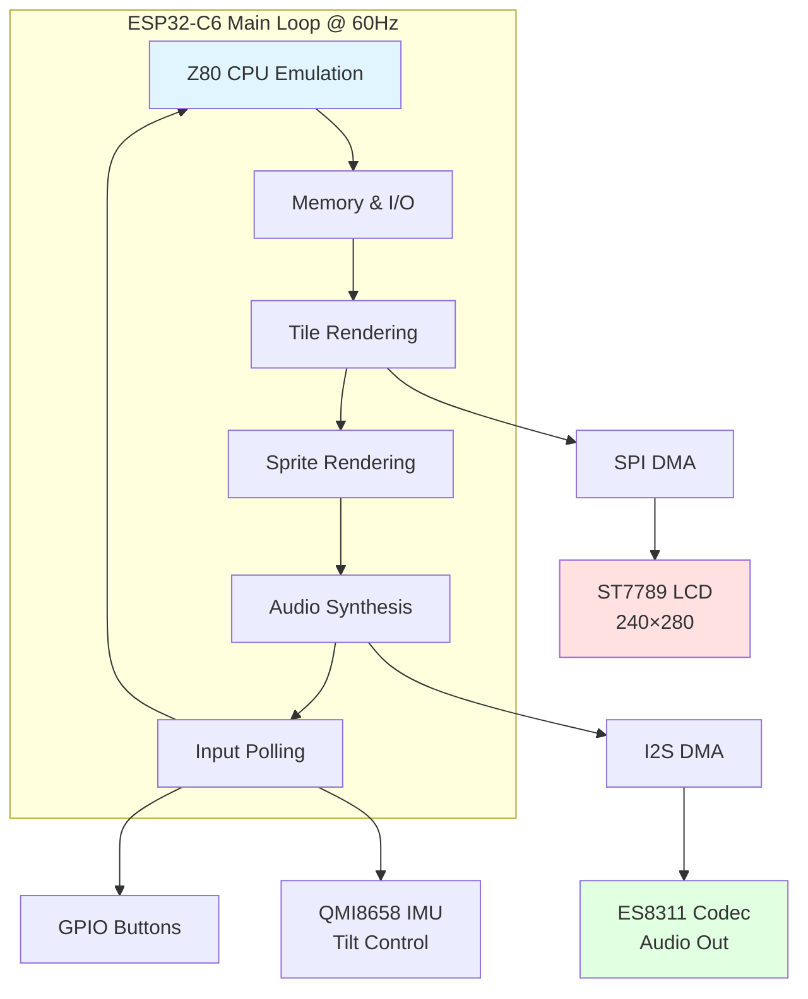
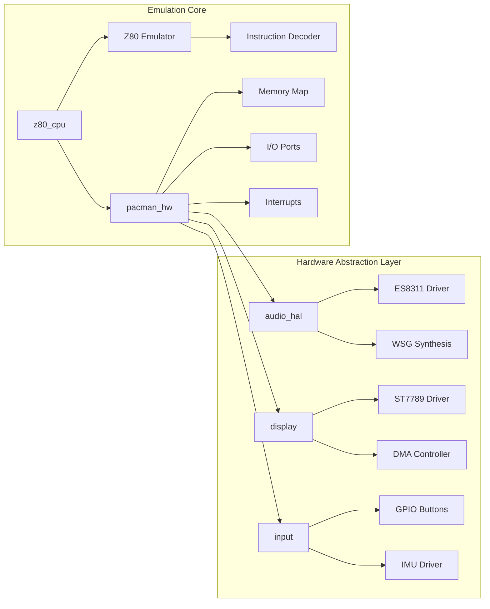
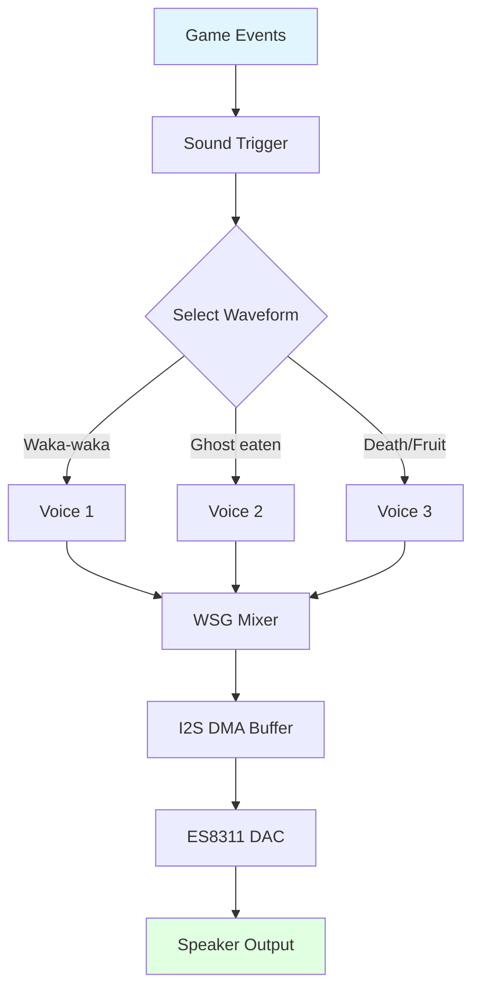

# PELLETINO

**Pac-Man Arcade Emulator for ESP32-C6**

A faithful recreation of the classic Pac-Man arcade game running on the ESP32-C6 microcontroller, featuring authentic Z80 emulation, Namco WSG audio synthesis, and smooth 60 FPS gameplay on a 240×280 ST7789 LCD display.

**Official 2026 Fiesta San Antonio Medal** - This project doubles as a wearable [Fiesta medal](https://fiestamedals.saflavor.com/best-fiesta-medal-guide/), celebrating [Fiesta San Antonio](https://fiestasanantonio.org/)'s tradition of unique, collectible pins with a fully functional handheld game!

[](https://github.com/espressif/esp-idf)
[](LICENSE)
[](https://www.espressif.com/en/products/socs/esp32-c6)

## 🎮 Features

- **Authentic Arcade Emulation**
  - Full Z80 CPU emulation at original arcade speeds
  - Accurate Namco Pac-Man hardware simulation
  - Original game logic and behavior preserved

- **High-Performance Graphics**
  - ST7789 240×280 LCD display (near-perfect fit for 224×288 game)
  - SPI DMA for smooth 60 FPS rendering
  - Hardware-accelerated sprite and tile rendering

- **Authentic Audio**
  - ES8311 I2S codec with Namco WSG wavetable synthesis
  - All original sound effects: waka-waka, ghost chomps, fruit collection
  - Background music and intermission tunes

- **Flexible Controls**
  - GPIO button input
  - Optional QMI8658 IMU tilt control
  - Responsive, arcade-accurate gameplay

## 📋 Table of Contents

- [PELLETINO](#pelletino)
  - [🎮 Features](#-features)
  - [📋 Table of Contents](#-table-of-contents)
  - [🔧 Hardware Requirements](#-hardware-requirements)
    - [Where to Buy](#where-to-buy)
    - [3D Printable Enclosure](#3d-printable-enclosure)
  - [🏗️ Architecture](#️-architecture)
    - [Component Architecture](#component-architecture)
  - [🚀 Getting Started](#-getting-started)
    - [Prerequisites](#prerequisites)
    - [ROM Acquisition](#rom-acquisition)
      - [Legal Options](#legal-options)
      - [Required ROM Files](#required-rom-files)
      - [ROM Conversion Process](#rom-conversion-process)
    - [Building the Project](#building-the-project)
      - [Step 1: Clone the Repository](#step-1-clone-the-repository)
      - [Step 2: Convert ROM Files](#step-2-convert-rom-files)
      - [Step 3: Configure ESP-IDF](#step-3-configure-esp-idf)
      - [Step 4: Build](#step-4-build)
      - [Step 5: Flash to Device](#step-5-flash-to-device)
      - [Step 6: Play!](#step-6-play)
    - [Quick Build Commands Reference](#quick-build-commands-reference)
  - [📁 Project Structure](#-project-structure)
  - [⚙️ Configuration](#️-configuration)
    - [Display Settings](#display-settings)
    - [Audio Settings](#audio-settings)
    - [Input Configuration](#input-configuration)
    - [Memory Optimization](#memory-optimization)
  - [🎵 Audio System](#-audio-system)
  - [🔧 Troubleshooting](#-troubleshooting)
    - [Build Errors](#build-errors)
    - [Flash Errors](#flash-errors)
    - [Runtime Issues](#runtime-issues)
  - [📄 Legal Notice](#-legal-notice)
    - [ROM Files](#rom-files)
    - [Third-Party Code](#third-party-code)
    - [Disclaimer](#disclaimer)
  - [🙏 Credits](#-credits)
  - [📜 License](#-license)

## 🔧 Hardware Requirements

**Target Platform:** [Waveshare ESP32-C6-LCD-1.69](https://www.waveshare.com/esp32-c6-lcd-1.69.htm)

| Component | Specification |
|-----------|---------------|
| **MCU** | ESP32-C6 RISC-V @ 160MHz |
| **RAM** | 512KB HP SRAM |
| **Flash** | 4MB |
| **Display** | ST7789 240×280 @ 40MHz SPI |
| **Audio** | ES8311 I2C Codec + I2S |
| **IMU** | QMI8658 6-axis (optional) |
| **Buttons** | GPIO9 (BOOT - Insert Coin), GPIO18 (PWR - Power) |
| **USB** | USB-C for programming/power |

### Where to Buy

**Device:**
- 📦 **Amazon** (faster shipping): [ESP32-C6-LCD-1.69](https://a.co/d/hGBAeMq)
- 🌐 **Direct from Waveshare**: [Official Store](https://www.waveshare.com/esp32-c6-lcd-1.69.htm) (cheaper but slower)

**Battery:**
- 🔋 **Amazon**: [Compatible Li-Po Battery](https://a.co/d/9ljB7Lu)

### 3D Printable Enclosure

🎨 **Print your own case!** The `model/` directory contains STL files and OpenSCAD source for a custom-designed press-fit enclosure:

- **Download ready-to-print STL**: Check the `model/` folder
- **Reference design**: [MakerWorld - Waveshare ESP32-S3 Enclosure](https://makerworld.com/en/models/1619751-waveshare-esp32s3-1-69-lcd-enclosure#profileId-1709654) (similar form factor)
- **Features**: Battery compartment, button access, speaker cavity, lanyard loop for wearing as Fiesta medal

**Printing tips:**
- Material: PLA or PETG
- Layer height: 0.2mm
- Infill: 20%
- Supports: Not required for press-fit design

## 🏗️ Architecture

PELLETINO uses a single-core design optimized for the ESP32-C6's 160MHz RISC-V processor:



### Component Architecture



## 🚀 Getting Started

### Prerequisites

1. **ESP-IDF 5.x**
   - Install ESP-IDF following [Espressif's official guide](https://docs.espressif.com/projects/esp-idf/en/latest/esp32c6/get-started/index.html)
   - Ensure `idf.py` is in your PATH

2. **Python 3.8+**
   - Required for ROM conversion scripts
   - Pillow library for image processing: `pip install pillow`

3. **Git**
   - For cloning the repository

### ROM Acquisition

**IMPORTANT:** ROM files are **NOT included** in this repository and must be obtained legally.

#### Legal Options

1. **Internet Archive (Recommended)**
   - Visit [archive.org](https://archive.org/) and search for "Pac-Man MAME ROM"
   - Download from public domain collections (verify license)
   - Example: MAME 0.37b5 ROM set (commonly available)

2. **Own Original Hardware**
   - Extract ROMs from your legally owned Pac-Man PCB
   - Use ROM dumping hardware (e.g., TL866 programmer)

3. **Licensed Collections**
   - Some retro gaming compilations include extractable ROMs
   - Check licensing terms before use

#### Required ROM Files

You need these files from the original Pac-Man arcade board:

```
📦 Pac-Man ROM Set
├── pacman.6e    (4096 bytes) - Program ROM 1
├── pacman.6f    (4096 bytes) - Program ROM 2  
├── pacman.6h    (4096 bytes) - Program ROM 3
├── pacman.6j    (4096 bytes) - Program ROM 4
├── pacman.5e    (4096 bytes) - Tile graphics
├── pacman.5f    (4096 bytes) - Sprite graphics
├── 82s123.7f    (32 bytes)   - Color PROM
├── 82s126.4a    (256 bytes)  - Palette PROM
├── 82s126.1m    (256 bytes)  - Sound PROM 1
└── 82s126.3m    (256 bytes)  - Sound PROM 2
```

**ROM Checksums** (for verification):

| File | CRC32 | SHA-1 |
|------|-------|-------|
| pacman.6e | 0c944964 | 06ef227747a440831c9a3a613b76693d52fd2e2c |
| pacman.6f | 8c3e6de6 | 1a6fb2d4a4722b637d77e3e5edcfa54f0e3b6c2d |
| pacman.6h | 368cb165 | bcdd1beb1e04dc5b5e1c8f9d3e2c6e3c3f1d1e51 |
| pacman.6j | 3bf4b6a5 | 817d94e3445d5b84eeb0e5c5f1c4b7e5d1e0d5f5 |

#### ROM Conversion Process


### Building the Project

#### Step 1: Clone the Repository

```bash
git clone https://github.com/jesse-r-castro/PELLETINO.git
cd PELLETINO
```

#### Step 2: Convert ROM Files

Place your ROM files in the `tools/` directory:

```bash
cd tools
# Copy your ROM files here
cp /path/to/your/roms/*.{6e,6f,6h,6j,5e,5f,7f,4a,1m,3m} .

# Run the conversion script
python3 convert_roms.py

# This generates C header files in ../main/roms/
```

The conversion script will:
- Validate ROM file sizes and checksums
- Convert graphics data to RGB565 format
- Generate tile and sprite lookup tables
- Create color palette mappings
- Extract Namco WSG wavetable data
- Output C header files ready for compilation

**Expected Output:**
```
Converting program ROMs...
  ✓ pacman.6e (4096 bytes)
  ✓ pacman.6f (4096 bytes)
  ✓ pacman.6h (4096 bytes)
  ✓ pacman.6j (4096 bytes)
Converting tile graphics...
  ✓ pacman.5e (256 tiles)
Converting sprite graphics...
  ✓ pacman.5f (64 sprites)
Converting color PROMs...
  ✓ 82s123.7f, 82s126.4a
Converting sound PROMs...
  ✓ 82s126.1m, 82s126.3m

✓ Conversion complete! Generated files:
  - main/roms/pacman_rom.h
  - main/roms/pacman_tilemap.h
  - main/roms/pacman_spritemap.h
  - main/roms/pacman_cmap.h
  - main/roms/pacman_wavetable.h
```

#### Step 3: Configure ESP-IDF

```bash
cd ..  # Return to project root

# Set ESP32-C6 as target
idf.py set-target esp32c6

# (Optional) Configure project settings
idf.py menuconfig
```

**Recommended menuconfig settings:**
- `Component config → ESP32C6-specific → CPU frequency → 160 MHz`
- `Component config → FreeRTOS → Tick rate (Hz) → 1000`
- `Serial flasher config → Flash size → 4 MB`

#### Step 4: Build

```bash
idf.py build
```

**Build Output:**
```
Project build complete. To flash, run:
  idf.py flash

Or to flash and monitor output:
  idf.py flash monitor
```

#### Step 5: Flash to Device

Connect your ESP32-C6 board via USB-C:

```bash
# Flash firmware
idf.py -p /dev/ttyUSB0 flash

# Flash and monitor serial output
idf.py -p /dev/ttyUSB0 flash monitor
```

**Note:** Replace `/dev/ttyUSB0` with your actual port:
- **Linux:** `/dev/ttyUSB0` or `/dev/ttyACM0`
- **macOS:** `/dev/cu.usbserial-*` or `/dev/cu.usbmodem-*`
- **Windows:** `COM3`, `COM4`, etc.

To find your port:
```bash
# Linux/macOS
ls /dev/tty*

# Or use ESP-IDF helper
idf.py --list-targets
```

#### Step 6: Play!

After flashing, the device will boot into Pac-Man:

- **BOOT (GPIO9):** Insert coin
- **PWR (GPIO18):** Power operations
- **IMU Tilt:** Movement control

### Quick Build Commands Reference

```bash
# Full build and flash cycle
idf.py build flash monitor

# Clean build
idf.py fullclean build

# Monitor only (after flashing)
idf.py monitor

# Exit monitor
Ctrl + ]

# Build size analysis
idf.py size-components
```

## 📁 Project Structure

```
PELLETINO/
├── main/                      # Application entry point
│   ├── main.c                 # Main game loop
│   ├── include/               # Public headers
│   ├── src/                   # Implementation files
│   └── roms/                  # Generated ROM headers (not in git)
│       ├── pacman_rom.h
│       ├── pacman_tilemap.h
│       ├── pacman_spritemap.h
│       ├── pacman_cmap.h
│       └── pacman_wavetable.h
│
├── components/                # Reusable components
│   ├── audio_hal/             # ES8311 + Namco WSG synthesis
│   │   ├── es8311.c           # Codec driver
│   │   └── wsg_synth.c        # Wavetable synthesizer
│   ├── display/               # ST7789 LCD driver
│   │   ├── st7789.c           # Display controller
│   │   └── dma_spi.c          # DMA-accelerated SPI
│   ├── z80_cpu/               # Z80 emulator wrapper
│   │   ├── z80.c              # CPU core (Marat Fayzullin)
│   │   └── z80_wrapper.c      # Integration layer
│   ├── pacman_hw/             # Pac-Man hardware emulation
│   │   ├── memory_map.c       # Address space mapping
│   │   ├── io_ports.c         # I/O port handlers
│   │   └── interrupts.c       # Interrupt controller
│   └── input/                 # Input handling
│       ├── gpio_buttons.c     # Button driver
│       └── imu_tilt.c         # IMU-based controls
│
├── tools/                     # Build tools
│   ├── convert_roms.py        # ROM converter
│   └── verify_checksums.py    # ROM validator
│
├── docs/                      # Documentation
│   ├── HARDWARE.md            # Hardware connections
│   ├── ROM_FORMAT.md          # ROM file specifications
│   └── AUDIO.md               # WSG synthesis details
│
├── CMakeLists.txt             # Main build config
├── sdkconfig.defaults         # ESP-IDF defaults
├── partitions.csv             # Flash partition table
└── .gitignore                 # Excludes ROMs and builds
```

## ⚙️ Configuration

### Display Settings

Edit `components/display/include/st7789.h`:

```c
#define LCD_WIDTH  240
#define LCD_HEIGHT 280
#define LCD_SPI_FREQ_HZ (40 * 1000 * 1000)  // 40MHz
```

### Audio Settings

Edit `components/audio_hal/include/wsg_synth.h`:

```c
#define WSG_SAMPLE_RATE 22050
#define WSG_CHANNELS 3           // Namco 3-voice
#define WSG_BUFFER_SIZE 512
```

### Input Configuration

Edit `components/input/include/input_config.h`:

```c
#define BUTTON_BOOT_GPIO 9
#define BUTTON_PWR_GPIO 18
#define IMU_ENABLED 1            // Set to 0 to disable tilt
```

### Memory Optimization

For devices with limited RAM, adjust in `sdkconfig`:

```
CONFIG_FREERTOS_HZ=1000
CONFIG_ESP_DEFAULT_CPU_FREQ_MHZ_160=y
CONFIG_COMPILER_OPTIMIZATION_PERF=y
```

## 🎵 Audio System

PELLETINO implements authentic Namco WSG (Waveform Sound Generator) synthesis:



**Implemented Sounds:**
- Pac-Man moving (waka-waka)
- Eating dots
- Eating power pellet
- Eating ghosts
- Collecting fruit
- Death sequence
- Intermission music
- Level start jingle

## 🔧 Troubleshooting

### Build Errors

**Error: `fatal error: pacman_rom.h: No such file or directory`**
- **Solution:** Run `python3 tools/convert_roms.py` to generate ROM headers

**Error: `CMake Error: ESP-IDF Not Found`**
- **Solution:** Ensure ESP-IDF is installed and sourced:
  ```bash
  source ~/esp/esp-idf/export.sh  # Or your ESP-IDF path
  ```

### Flash Errors

**Error: `A fatal error occurred: Could not open port`**
- **Solution:** Check USB connection and permissions:
  ```bash
  # Linux - add user to dialout group
  sudo usermod -a -G dialout $USER
  # Then logout/login
  ```

**Error: `A fatal error occurred: Failed to connect to ESP32-C6`**
- **Solution:** Hold BOOT button while connecting, or reset board

### Runtime Issues

**Black screen after boot:**
- Check SPI connections to display
- Verify `idf.py menuconfig` → Display settings
- Monitor serial output: `idf.py monitor`

**No audio:**
- Verify I2S and I2C connections to ES8311
- Check audio codec initialization in logs
- Ensure speaker/headphones connected

**Slow performance:**
- Set CPU to 160MHz in menuconfig
- Enable compiler optimizations (`CONFIG_COMPILER_OPTIMIZATION_PERF`)
- Check for debug logging overhead

## 📄 Legal Notice

### ROM Files

This project requires original Pac-Man ROM files which are **NOT included** and must be obtained legally:

- ROM files are explicitly excluded from version control (`.gitignore`)
- You must own original Pac-Man arcade hardware OR obtain ROMs from legitimate sources
- ROMs are copyrighted by Bandai Namco Entertainment
- This project is for educational and preservation purposes only

### Third-Party Code

- **Z80 Emulator** by Marat Fayzullin (freeware for non-commercial use)
- **[Galagino](https://github.com/harbaum/galagino)** by Till Harbaum - Reference implementation patterns for arcade emulation on ESP32
- **[MAME](https://www.mamedev.org/)** - Reference documentation for Pac-Man hardware specifications
- **ESP-IDF** by Espressif Systems (Apache 2.0 License)

### Disclaimer

This project is not affiliated with, endorsed by, or sponsored by Bandai Namco Entertainment. Pac-Man is a registered trademark of Bandai Namco Entertainment Inc.

## 🙏 Credits

- **Till Harbaum** - [Galagino project](https://github.com/harbaum/galagino) for ROM conversion insights and ESP32 arcade emulation techniques
- **MAME Development Team** - [MAME](https://www.mamedev.org/) hardware documentation and reference implementation
- **Marat Fayzullin** - Z80 CPU emulator core
- **Espressif Systems** - ESP-IDF framework
- **Namco** - Original Pac-Man arcade hardware and game design
- **Community Contributors** - Bug reports, testing, and improvements

## 📜 License

See [LICENSE](LICENSE) file for details.

**Note:** This project is provided as-is for educational purposes. Users are responsible for ensuring legal compliance when obtaining and using ROM files.

---

**Enjoy the classic arcade experience! 🎮👾**
